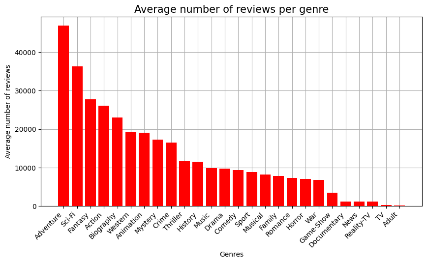
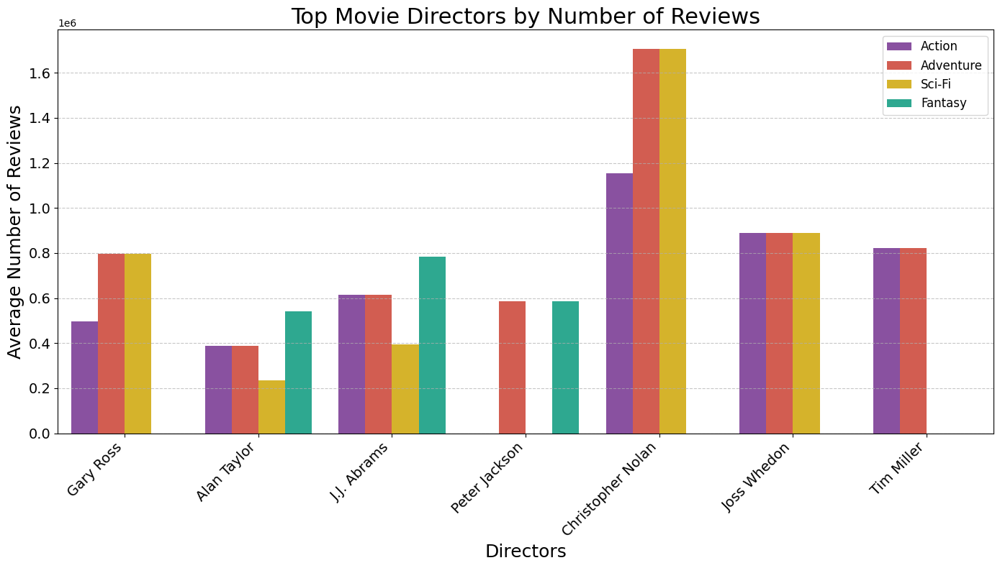

## Phase 1 Project: Microsoft Movie Studio Exploration and Data Analysis

Microsoft sees all the big companies creating original video content and they want to get in on the fun. They have decided to create a new movie studio, but they don’t know anything about creating movies.

Agenda
- Business Problem
- DataSets and Analysis Method
- Results
- Conclusion

Business Problem

Microsoft has observed the trend of major companies venturing into original video content 
creation and is keen to join the fray by establishing its own movie studio. However, lacking 
experience in the realm of filmmaking, Microsoft aims to leverage insights gleaned from 
analyzing the top-performing movies of the past decade to chart a course to success.
 Upon careful examination of successful films, a discernible pattern emerges, highlighting key 
factors pivotal to their triumph:
1. Genre Selection: The first step in Microsoft's journey toward creating a blockbuster involves determining the 
type of movie it wishes to produce. By identifying popular genres and assessing market demand, Microsoft can 
make an informed decision on the genre that aligns best with its objectives and audience preferences.
2. Directorial Expertise: With the genre chosen, Microsoft must then focus on selecting the right director for the 
project. Drawing from the lessons learned from top-performing movies, the studio can prioritize directors 
known for their proficiency in the chosen genre. This strategic decision ensures that the creative vision of the 
film is expertly executed, enhancing its potential for success.
3. Casting the Perfect Ensemble: A critical aspect of any successful movie is the caliber of its cast. Microsoft 
recognizes the importance of hiring talented actors who can bring the characters to life and resonate with 
audiences. Through meticulous casting decisions, the studio can assemble a stellar ensemble, elevating the 
quality and appeal of the movie

Data Sets and Analysis Method

Top Movie Directors

Top Movie Actors

Conclusions

The analysis provides valuable insights for a new movie studio aiming to create a blockbuster:

Choosing the Genre: To maximize success, the studio should focus on Adventure, Sci-Fi, Action, or Fantasy, as these genres are the most popular and successful.

Selecting the Director: For each chosen genre, hiring the director with the most success in that genre is crucial. Christopher Nolan stands out for Action, Sci-Fi, and Adventure films, while J.J. Abrams is the top choice for Fantasy.

Picking the Lead Actor: Leonardo DiCaprio emerges as the top overall actor, making him an ideal candidate for the main role in most genres. However, for a Fantasy movie, Oscar Isaac could also be a great choice.
